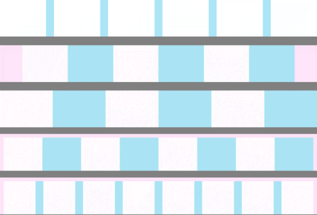

# laGrille.js
Ajoute une grille (colonnes avec des gouttières (facultatif)) sur votre page web (comme inDesign)



## usage:

```html
<script src="js/laGrille.js" charset="utf-8"></script>
```

dans \<script>
```js
const grille = laGrille.draw({'column':8.5, 'margin':0, 'gutter':0,'level':"down"});
```

- `column:` Nombre de colonnes. Si valeur est "x.5", la grille contient "x" colonnnes + une demi de chaque coté.
- `gutter:` Gouttière entre les colonnes. Par défaut en px, accepte une `String` unités en, 'em', 'rem', 'vh' ou 'vw';
- `margin:` Marge en `Number` en px, accepte une `String` unités en, 'em', 'rem', 'vh' ou 'vw';
- `level:` "down" ou "down", crée le canvas en dessous ou au dessus de tout. Par défaut: "up";
- `color:` Couleur désignée en propriété css. Par défaut: 'rgba(0,176,228,.33)' 
- `colorM:` Couleur désignée en propriété css. Par défaut: 'rgba(255, 100, 217,.33)',
